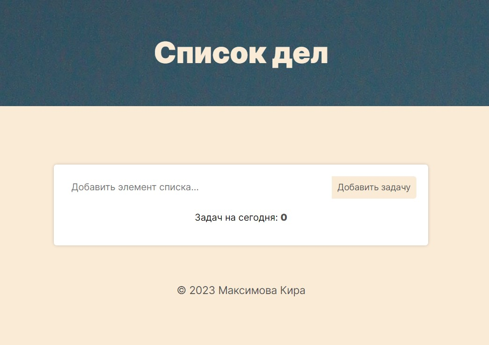
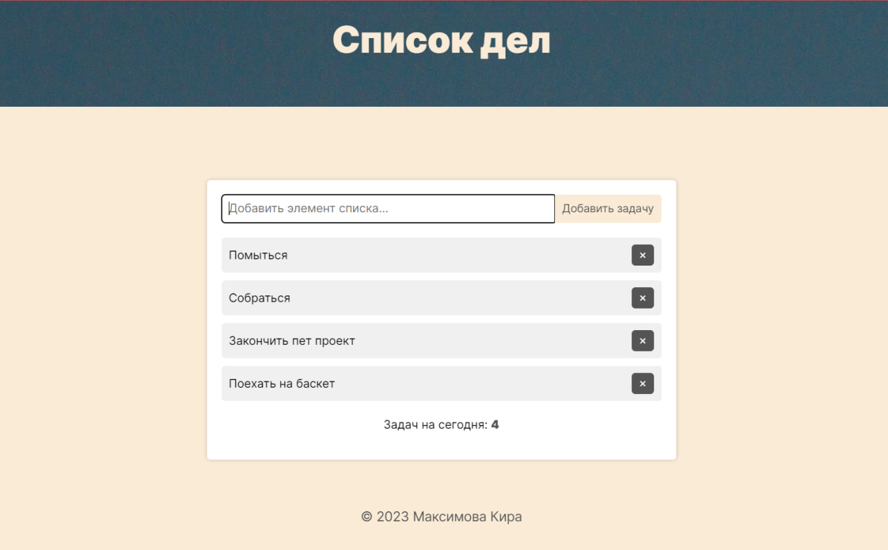

# Проект: todo-list

В данном проекте я реализовала классический todo-list, в который можно добавлять список задач (например). Так же реализована возможность удаления каждой задачи после её выполнения, и подсчёт количества задач внизу формы, чтобы Вы не забывали, как много ещё нужно сделать, для того, чтобы быть молодчинкой <3 🥰

### Обзор

**Картинки**

**Макет**

Идея возникла внезапно, так что придумывала внешний вид сама на "быструю руку". Вроде получилось неплохо!

**Ссылка на проект**

* [Ссылка на проект]()